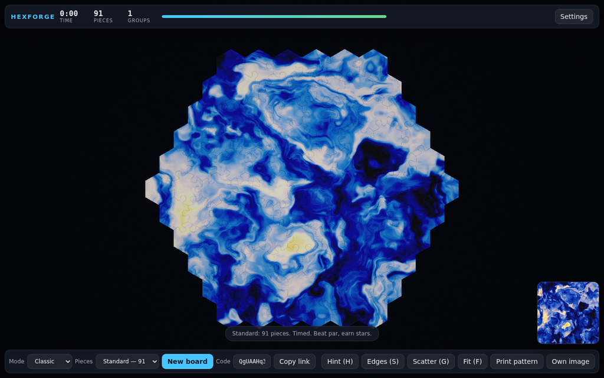
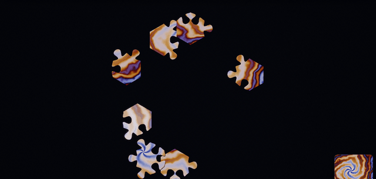
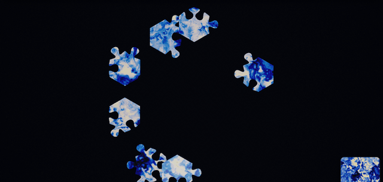
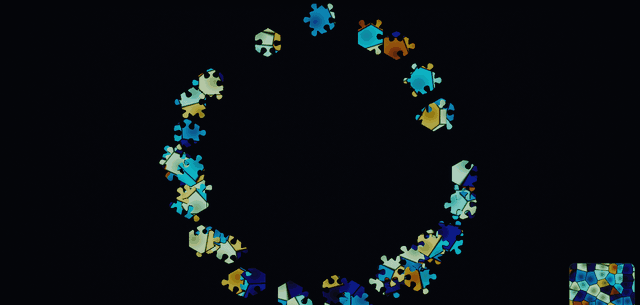
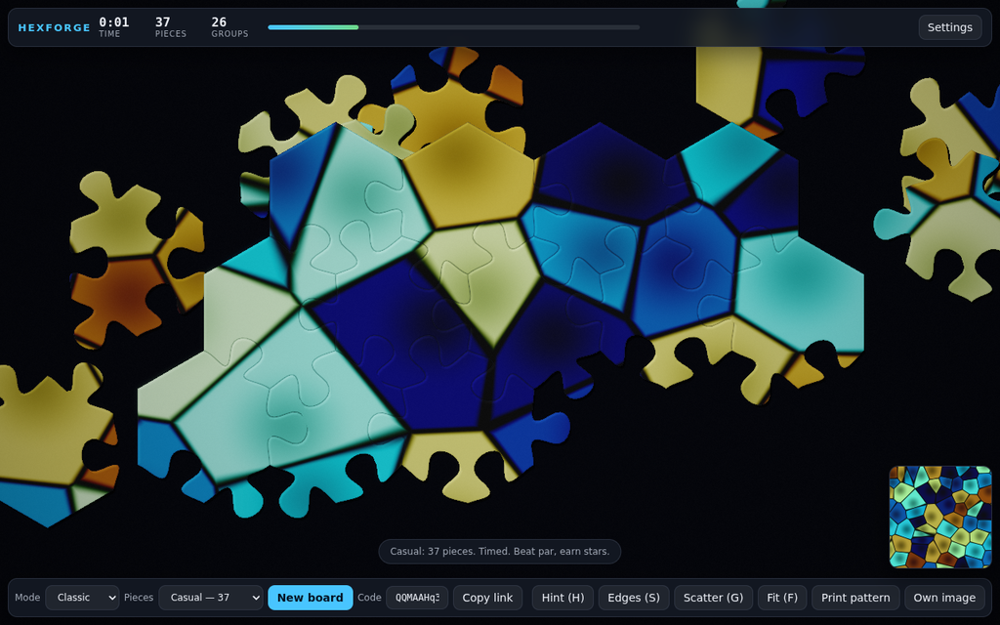
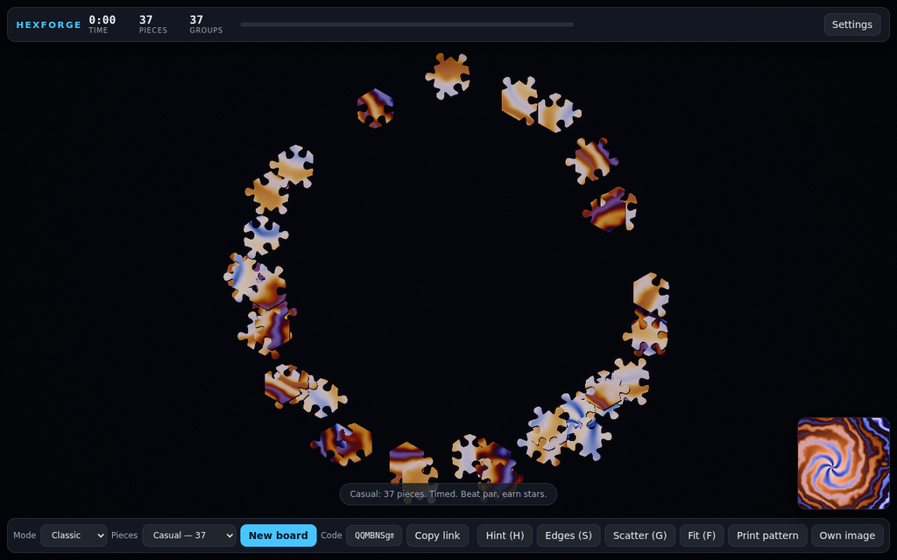
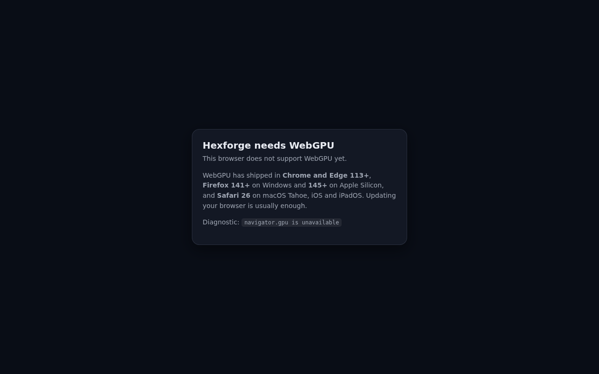

# Hexforge

A hexagonal jigsaw puzzle for the browser, rendered with WebGPU.

**[▶ Play it](https://rpcal.github.io/hex-puzzle-generator/)** · zero runtime dependencies · 33 kB gzipped



Take an image, shatter it into interlocking hexagonal pieces with organic hand-made-looking cuts,
and put it back together. The whole board draws in a single GPU call. The cut is a pure function of
its seed, so a twelve-character link reproduces the exact same puzzle for anyone who opens it. And
because this project grew out of a jig for printing paper puzzles, it still exports the cut pattern
as a print-ready SVG — the puzzle you print and the puzzle you play are the same puzzle.

---

## Drag, snap, weld

Pieces are dragged with a spring, so a cluster has weight. Release near where a piece belongs and it
welds: the join is celebrated with a burst of sparks tinted from the picture itself, a bloom pulse
along the seam, and a click synthesised on the spot whose pitch rises with the size of the group you
just closed.



Connected pieces become one rigid body. A forty-piece cluster drags, rotates and snaps as a single
unit — and costs a single transform to move, because welded pieces are by definition already at
their exact solved positions relative to one another.



Finish it and the cut shading fades out, leaving the picture seamless.



Up close, every piece is a real cut: a bevelled edge, a contact shadow just inside the boundary, and
a rim light so pieces stay legible against one another even where the picture is dark.



---

## Playing

| | |
|---|---|
| **Drag** | Pick up a piece and its whole cluster. Release to snap. |
| **Pan / zoom** | Drag empty board; wheel or pinch to zoom about the cursor. `F` fits the board. |
| **Keyboard** | `Tab` cycles pieces, arrows nudge (`Shift` for bigger steps), `Enter` places, `Q`/`E` rotate. |
| **Gamepad** | Left stick moves the held piece, `A` grabs and releases, shoulders cycle. |
| **Assists** | `H` hint, `S` gather the edge pieces, `G` re-scatter. |

A board is completable with **no pointer at all** — that is a tested requirement, not a claim: the
e2e suite solves a board using only `Tab`, the arrow keys and `Enter`, with zero pointer events.

### Modes

| Mode | Rule |
|---|---|
| **Classic** | Timed. Par by piece count, stars on finish. |
| **Zen** | No clock, no score. |
| **Rotation** | Pieces arrive turned. Match the angle as well as the place. |
| **Mirror** | The reference image is hidden. Solve by shape and local colour alone. |
| **Blitz** | Untouched pieces fade. Keep moving. |

### Difficulties

Sampler 7 · Casual 37 · Standard 91 · Hard 217 · Brutal 469 · **Forge 1027**

Tabs get smaller and jitter grows as the count rises: less silhouette to match on, and less
resemblance between pieces that are not actually neighbours.

---

## Print a real one



This project began in 2018 as a **print jig**. A commented line in its HTML read
*"Wymiary pliku w pikselach do druku w jakości 72 DPI: 842 x 1 191 px"* — A4 at 72 DPI — and its
print stylesheet hid the file picker. You loaded a photo, it stroked a hex lattice over it, you
printed it and cut along the lines.

That still works, and it is better than it was. **Export → Print pattern** produces an SVG with:

- true cubic Béziers, not the flattened polyline the GPU rasterises
- real physical dimensions in millimetres for A4, A3 or Letter
- registration marks and a legend carrying the puzzle code
- **each shared cut line stroked exactly once**

That last point was the original's entire reason for existing — a doubled stroke prints at double
ink density — and it used to require a hand-tuned drawing loop with a special case for the last row.
Here it falls out of the data model: every interior edge is owned by exactly one of its two hexes.

---

## How it works

```
src/core/   pure logic. no DOM, no GPU, no side effects
  math/       hex axial coordinates, 2×3 affine, cubic Bézier + adaptive flattening
  rng/        counter-based hashing — stateless, so determinism does not depend on order
  cut/        edge ownership, the tab curve, board generation, triangulation, GPU mesh
  solve/      union-find clusters, zoom-aware snapping
  board/      a playable session, drivable with no browser at all
  score/      par curve and star thresholds
  seed/       the twelve-character puzzle code
src/gfx/    WebGPU. knows nothing about the rules of the game
src/game/   the loop, camera, input, audio, persistence
src/ui/     HUD. plain DOM, no framework
src/print/  the SVG cut-pattern export
```

The dependency direction is one-way and **enforced by a test**: `core` imports nothing from the
project, and may not mention `document`, `navigator`, `localStorage`, `GPUDevice` or `node:`
anything. That is what makes "generate a board, scatter it and solve it" a fast pure-function test
rather than something only a browser can run.

### One draw call

Pieces do not share a mesh — every silhouette is different — so instancing would mean a draw call
per piece. Instead the whole board is one vertex buffer and one index buffer, each vertex carrying
the id of the piece it belongs to, and the vertex shader looks that piece's transform up in a
storage buffer written by a compute pass. Instance 0 of the same call is the drop shadow.

### Triangles, not a distance field

The obvious approach is to evaluate the piece silhouette as a signed distance field in the fragment
shader: elegant, resolution-independent, and about **370 million distance tests per frame** at 1080p
against ~185 boundary segments. Real hardware tolerates that. SwiftShader — the CPU rasteriser the
CI runs on — does not.

So pieces are triangulated by ear clipping (they are not star-shaped: a jigsaw blank has a neck
narrower than the head it opens into, so a fan from the centre would emit triangles outside the
piece). Anti-aliasing, the bevel, the inner shadow and the rim light all come from a single
interpolated edge-distance attribute, which costs no per-fragment loops — and frees the `r32uint`
picking attachment, since that format cannot be multisampled.

### Deterministic by construction

Two pieces interlock because the generator produced **one** curve and handed the reversal to the
neighbour — not because two independently generated curves came out close enough. The test asserts
bit equality, not approximate equality.

Randomness is a counter-based hash rather than a stream, so edge 900's parameters can be computed
without generating edges 0–899. Determinism is structural rather than dependent on iteration order.

### The art is a function

Every bundled picture is generated on the GPU from a style index and a seed. No image files, no
download, no licence questions — and a shareable link stays twelve characters, because the picture
is reproducible rather than fetched. Your own images work too, and never leave your device.

---

## Testing

| Tier | Count | What it runs against |
|---|---|---|
| Unit | 285 | Node. Pure logic only. **97.3 % statements, 98.1 % lines** on `src/core` |
| GPU | 39 | A real WebGPU device, headless, on a machine with no GPU |
| e2e | 17 | A real browser, real mouse and keyboard events, real frames |

Getting WebGPU running headlessly was the one thing that could have made GPU tests, e2e tests and
these very GIFs impossible, so it was de-risked before a line of application code was written. Four
Chromium configurations were probed; exactly one gives a stable adapter with working compute
readback under SwiftShader ([`tools/webgpu-launch.ts`](tools/webgpu-launch.ts),
[`docs/RESEARCH.md §2.2`](docs/RESEARCH.md)).

The highest-value test in the project compiles every `.wgsl` file and asserts zero diagnostics. A
WGSL error does not throw: the module is created, the pipeline builds, the draw executes, and
nothing appears. On its first run it caught three real errors, including derivatives taken after a
`discard` — which WGSL forbids, and which is exactly what the obvious "early out, then shade"
version of a fragment shader does.

**On the performance claim:** the frame-budget test *skips* on a software adapter with an explicit
message rather than reporting a number from a CPU rasteriser as if it meant something. No frame time
has therefore been measured on real hardware in CI, and none is claimed here.

---

## Browser support

WebGPU became Baseline in January 2026 — Chrome and Edge 113+, Firefox 141+ on Windows and 145+ on
Apple Silicon, Safari 26 on macOS Tahoe, iOS and iPadOS. There is deliberately **no WebGL fallback**:
a second renderer would double the surface area of every visual bug to serve a shrinking minority,
and it would have to be a worse renderer, so the whole design would bend around it.

Browsers without WebGPU get a screen that says which ones have it, rather than a blank canvas:



---

## Development

```bash
npm install
npm run dev          # vite dev server
npm run typecheck    # tsc, strict
npm run lint         # oxlint
npm test             # unit tests
npm run test:gpu     # against a real WebGPU device
npm run test:e2e     # playwright
npm run test:all     # everything
npm run build        # production build
npm run size         # bundle budget: 150 kB gzipped
npm run media        # regenerate every image in this README by playing the game
```

Every screenshot and GIF above is generated by `npm run media`, which drives the real build through
the real input path and captures real frames. Nothing is staged, and the README cannot drift away
from what the game actually looks like.

---

## Where this came from

The repository started as 265 lines of TypeScript from 2018: webpack 4, jest 23 (with no test
files), TypeScript 3.0, and a `Grid` class that stroked a hexagonal lattice onto a 2D canvas so you
could print it. It had a typo in its main method name (`drawWithoudRepeat`), five bugs, and one
genuinely good idea.

The good idea was refusing to draw any edge twice. That is now the invariant the entire cut rests
on. The tessellation constants it got right — `h = R√3/2`, `hs = 2h`, `vs = 1.5R` — are unchanged.
Everything else is new.

A full account of what the original did, what carried forward and what did not, is in
[`docs/RESEARCH.md`](docs/RESEARCH.md); the design is in [`docs/SPEC.md`](docs/SPEC.md) and the
build order in [`docs/PLAN.md`](docs/PLAN.md).

---

## Licence

MIT. See [LICENSE](LICENSE).

The tab-curve parameterisation is adapted from a CC0 SVG jigsaw generator by
[draradech](https://github.com/draradech/jigsaw); the randomness driving it is not.
